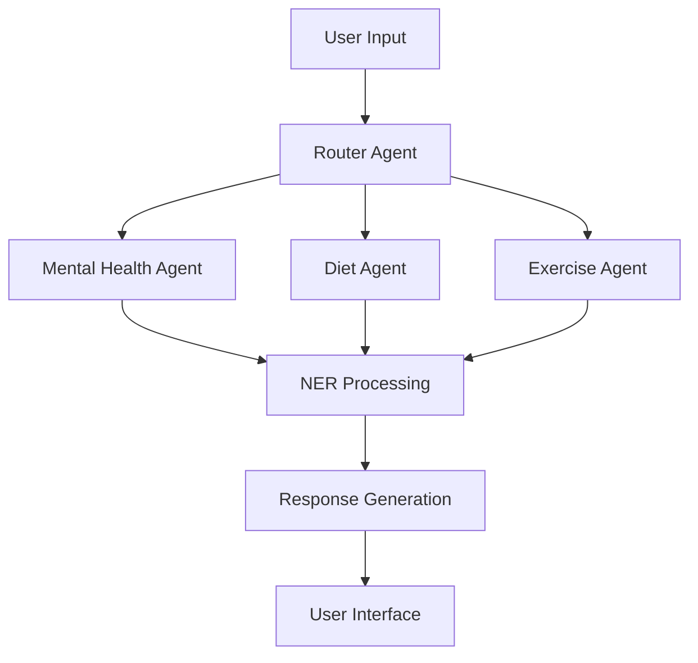
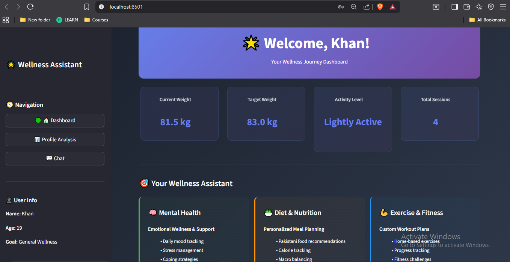
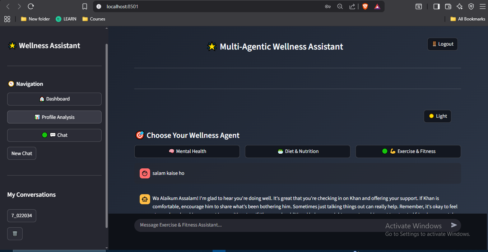
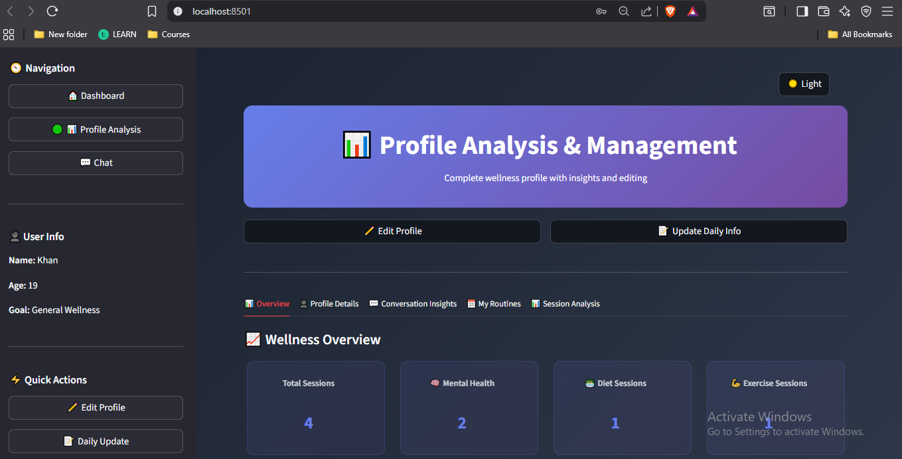
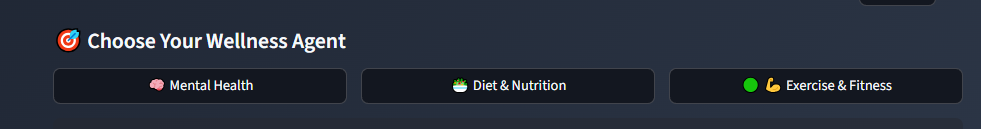

# 🌟 Multi-Agent Wellness Assistant

A comprehensive wellness companion powered by AI agents, designed specifically for holistic health management with culturally-aware support for Pakistani users.

## 📖 Table of Contents

- [Overview](#overview)
- [Features](#features)
- [Architecture](#architecture)
- [Installation](#installation)
- [Configuration](#configuration)
- [Usage](#usage)
- [Agent Capabilities](#agent-capabilities)
- [Screenshots](#screenshots)
- [Project Structure](#project-structure)
- [Database Design](#database-design)
- [API Integration](#api-integration)
- [Contributing](#contributing)
- [License](#license)

## 🎯 Overview

The Multi-Agent Wellness Assistant is an AI-powered health companion that provides personalized guidance across three key wellness domains: **Mental Health**, **Diet & Nutrition**, and **Exercise & Fitness**. Built with cutting-edge LangGraph and Streamlit technologies, it offers a seamless, conversational interface with specialized AI agents for each wellness area.

### 🌟 Key Highlights

- **🤖 Multi-Agent Architecture**: Specialized AI agents with domain expertise
- **🇵🇰 Culturally Aware**: Tailored for Pakistani lifestyle, cuisine, and social dynamics
- **🧠 Persistent Memory**: Advanced conversation tracking with Named Entity Recognition (NER)
- **🗄️ Hybrid Database**: SQLite + JSON fallback for bulletproof data storage
- **📌 Fixed Sidebar Navigation**: Professional UI that never collapses - consistent across all pages
- **⚡ Real-time Chat**: Instant AI responses with full conversation context
- **👤 Profile Management**: Comprehensive wellness profiles with progress tracking
- **🔒 Privacy First**: All data stored locally - no cloud dependencies

## ✨ Features

### 🧠 Mental Health Support
- Daily emotional check-ins and mood tracking
- Evidence-based coping strategies for stress and anxiety
- Cultural sensitivity for Pakistani family dynamics
- Crisis intervention with local helpline information
- Long-term memory for tracking emotional patterns

### 🥗 Diet & Nutrition Guidance
- Personalized meal planning with Pakistani cuisine
- Nutritional analysis and calorie tracking
- Local food availability and market considerations
- Ramadan-specific meal planning (Sehri/Iftar)
- Budget-conscious meal suggestions

### 💪 Exercise & Fitness Coaching
- Home-based workout routines with minimal equipment
- Climate-aware exercises for Pakistani weather
- Progressive difficulty adjustment
- Form guidance and safety instructions
- Performance tracking and motivation

### 🔧 Technical Features
- **Persistent Conversations**: Chat history with session management
- **Theme Support**: Dark/Light mode toggle
- **User Profiles**: Comprehensive wellness profiles
- **Data Analytics**: Usage insights and progress tracking
- **Responsive Design**: Works on desktop and mobile devices
- **Fixed Sidebar**: Professional navigation that cannot collapse

## 🏗️ Architecture

### Multi-Agent System



### 🛠️ Technology Stack

- **Frontend**: Streamlit with custom CSS/JavaScript for professional UI
- **Backend**: LangGraph for sophisticated multi-agent state management
- **AI Models**: OpenAI GPT models integrated via LangChain
- **Database**: SQLite (primary) + JSON fallback for reliability
- **State Management**: LangGraph checkpointing for conversation persistence
- **Environment**: Python 3.8+ with virtual environment support
- **Architecture**: Hybrid data storage with automatic fallback mechanisms

## 📥 Installation

### Prerequisites
- Python 3.8 or higher
- OpenAI API key
- Git

### Step-by-Step Installation

1. **Clone the repository**
   ```bash
   git clone https://github.com/uzairkbrr/MultiAgent_NIC.git
   cd MultiAgent_NIC
   ```

2. **Create virtual environment** (recommended)
   ```bash
   python -m venv wellness_env
   source wellness_env/bin/activate  # On Windows: wellness_env\Scripts\activate
   ```

3. **Install dependencies**
   ```bash
   pip install -r requirements.txt
   ```

4. **Set up environment variables**
   ```bash
   # Copy the template
   cp .env.example .env
   
   # Edit .env file and add your OpenAI API key:
   # OPENAI_API_KEY=your_openai_api_key_here
   ```

5. **Initialize database** (optional - auto-creates if needed)
   ```bash
   python -c "from database import init_database; init_database()"
   ```

6. **Run the application**
   ```bash
   streamlit run frontend.py
   ```
   
   The app will automatically open in your browser at `http://localhost:8501`

## ⚙️ Configuration

### Environment Variables

Create a `.env` file in the root directory:

```env
# Required
OPENAI_API_KEY=your_openai_api_key_here

# Optional (for future enhancements)
ANTHROPIC_API_KEY=your_anthropic_key
GOOGLE_API_KEY=your_google_key
GROQ_API_KEY=your_groq_key
HUGGINGFACEHUB_API_TOKEN=your_huggingface_token
ELEVENLABS_API_KEY=your_elevenlabs_key
```

### Database Configuration

The application uses a hybrid database approach:
- **Primary**: SQLite database (`wellness_app.db`)
- **Fallback**: JSON files for data persistence
- **Chat History**: SQLite with LangGraph checkpointing (`history.db`)

## 🚀 Usage

### Getting Started

1. **Launch the application**
   ```bash
   streamlit run frontend.py
   ```

2. **Create user profile**
   - Fill in personal information (name, age, height, weight, goals)
   - Set dietary preferences and restrictions
   - Define fitness level and activity preferences

3. **Choose your agent**
   - Mental Health: For emotional support and stress management
   - Diet & Nutrition: For meal planning and nutritional guidance
   - Exercise & Fitness: For workout routines and fitness tracking

4. **Start conversing**
   - Ask questions in natural language
   - Get personalized recommendations
   - Track your progress over time

### 🧭 Navigation

The application features a **professional fixed sidebar** that never collapses and provides:
- **🏠 Dashboard**: Overview of your wellness journey with key metrics
- **📊 Profile Analysis**: Detailed insights and comprehensive profile management  
- **💬 Chat**: Interactive conversation interface with specialized AI agents
- **⚡ Quick Actions**: Edit profile, daily health updates, routine management

> **Key Feature**: The sidebar is **permanently fixed** and cannot be collapsed, ensuring consistent navigation and professional user experience across all pages.

## 🤖 Agent Capabilities

### Mental Health Agent
- **Emotional Assessment**: Daily mood tracking and analysis
- **Coping Strategies**: Personalized stress management techniques
- **Crisis Support**: Local helpline integration (Pakistan-specific)
- **Progress Tracking**: Long-term emotional pattern recognition
- **Cultural Sensitivity**: Awareness of Pakistani social dynamics

### Diet & Nutrition Agent
- **Meal Planning**: Customized plans with Pakistani cuisine
- **Nutritional Analysis**: Calorie and macro tracking
- **Local Integration**: Market availability and seasonal foods
- **Special Occasions**: Ramadan, Eid, and cultural meal planning
- **Budget Optimization**: Cost-effective healthy eating

### Exercise & Fitness Agent
- **Workout Design**: Home-based routines with minimal equipment
- **Progressive Training**: Difficulty adjustment based on performance
- **Climate Awareness**: Indoor/outdoor alternatives for Pakistani weather
- **Form Guidance**: Detailed exercise instructions and safety tips
- **Motivation System**: Goal setting and achievement tracking

## 📸 Screenshots

### Dashboard Overview

*Main dashboard showing wellness metrics and fixed sidebar navigation*

### Chat Interface  

*Multi-agent chat with persistent sidebar and session history*

### Profile Management
 
*Comprehensive profile analysis with quick action sidebar*

### Agent Selection

*Visual agent switching with clear active agent indication*

### Key UI Features:
- ✨ **Fixed Sidebar**: Always visible navigation that cannot collapse
- 🎯 **Agent Switching**: Visual buttons for different wellness domains  
- 💬 **Clean Chat**: Conversation view with timestamps and history
- 📊 **Dashboard**: Wellness metrics and progress visualization
- ⚙️ **Profile Management**: Comprehensive user settings
- 🌓 **Theme Toggle**: Dark/Light mode support
- 📱 **Professional Layout**: Consistent sidebar across all pages

## 📁 Project Structure

```
MultiAgent_NIC/
├── frontend.py              # Main Streamlit application
├── backend.py              # Multi-agent logic and API integration
├── database.py             # Database operations and models
├── database_manager.py     # Advanced database management
├── prompts.py              # AI agent prompts and instructions
├── requirements.txt        # Python dependencies
├── README.md              # Project documentation
├── pakistan_features.md   # Cultural features documentation
├── HYBRID_DATABASE_SUMMARY.md  # Database architecture details
├── .env                   # Environment variables (create from .env.example)
├── .env.example          # Environment template
├── .gitignore            # Git ignore rules
├── screenshots/          # Application screenshots for documentation
├── wellness_app.db       # Main SQLite database
├── history.db            # Chat history database
├── users_data.json       # User data backup (JSON)
├── wellness_data/        # User wellness data files
└── ner_data/             # Named Entity Recognition data
```

### Core Files Description

- **`frontend.py`**: Main Streamlit application with UI components and navigation
- **`backend.py`**: Multi-agent system implementation using LangGraph
- **`database.py`**: Database models, operations, and hybrid storage system
- **`prompts.py`**: Carefully crafted prompts for each AI agent
- **`database_manager.py`**: Advanced database operations and migrations

## 🗄️ Database Design

### Hybrid Storage System

The application uses a sophisticated hybrid storage approach:

#### SQLite Tables
```sql
-- Users table
CREATE TABLE users (
    user_id TEXT PRIMARY KEY,
    full_name TEXT NOT NULL,
    email TEXT UNIQUE,
    created_at TIMESTAMP DEFAULT CURRENT_TIMESTAMP
);

-- User profiles with wellness data
CREATE TABLE user_profiles (
    user_id TEXT PRIMARY KEY,
    age INTEGER,
    height REAL,
    current_weight REAL,
    target_weight REAL,
    activity_level TEXT,
    dietary_preferences TEXT,
    medical_conditions TEXT,
    goals TEXT,
    updated_at TIMESTAMP DEFAULT CURRENT_TIMESTAMP
);

-- Chat sessions and conversations
CREATE TABLE chat_sessions (
    session_id TEXT PRIMARY KEY,
    user_id TEXT NOT NULL,
    agent_type TEXT NOT NULL,
    created_at TIMESTAMP DEFAULT CURRENT_TIMESTAMP,
    last_updated TIMESTAMP DEFAULT CURRENT_TIMESTAMP
);
```

#### JSON Fallback
- Automatic fallback to JSON files if SQLite operations fail
- Maintains data integrity across different deployment environments
- Easy backup and migration capabilities

## 🔌 API Integration

### OpenAI Integration
- **Models Used**: GPT-3.5-turbo, GPT-4 (configurable)
- **Token Management**: Efficient prompt design to minimize costs
- **Error Handling**: Robust fallback mechanisms

### LangGraph State Management
- **Persistent Memory**: Conversation state preservation
- **Multi-turn Conversations**: Context-aware responses
- **Agent Coordination**: Seamless handoffs between specialized agents

## 🛠️ Development

### Running in Development Mode

1. **Enable debug mode**
   ```bash
   export STREAMLIT_ENV=development
   streamlit run frontend.py --server.runOnSave=true
   ```

2. **Database debugging**
   ```python
   from database import init_database, get_db_status
   init_database()
   print(get_db_status())
   ```

### Testing

```bash
# Test database operations
python -c "from database import test_database_operations; test_database_operations()"

# Test agent responses
python -c "from backend import test_agent_routing; test_agent_routing()"
```

### Adding New Features

1. **New Agent**: Add to `backend.py` with corresponding prompt in `prompts.py`
2. **Database Changes**: Update `database.py` and run migrations
3. **UI Components**: Extend `frontend.py` with new Streamlit components

## 🎨 Customization

### Themes
The application supports dark and light themes with custom CSS:
- Modify theme colors in `frontend.py`
- CSS classes are dynamically applied based on user preference

### Sidebar Behavior
The sidebar is fixed and cannot be collapsed by design:
- Enhanced user experience with consistent navigation
- Professional layout suitable for wellness applications
- Responsive design adapts to different screen sizes

## 🔒 Privacy & Security

- **Local Data Storage**: All user data stored locally in SQLite/JSON
- **API Security**: Environment variables for sensitive keys
- **Data Encryption**: Future enhancement for sensitive health data
- **Privacy First**: No user data shared with third parties

## 🌍 Cultural Adaptations

### Pakistani Context
- **Local Food Database**: Traditional Pakistani dishes and ingredients
- **Cultural Sensitivity**: Family dynamics and social considerations
- **Language Support**: English with Urdu cultural references
- **Religious Considerations**: Halal dietary requirements, prayer times
- **Climate Awareness**: Weather-appropriate exercise recommendations

## 🔧 Troubleshooting

### Common Issues & Solutions

1. **🚫 Sidebar not showing or collapsing**
   - **Solution**: Hard refresh the browser (`Ctrl+F5` or `Cmd+Shift+R`)
   - **Note**: Sidebar is designed to be permanently fixed - if collapsing, there may be a browser cache issue
   - Check browser console for JavaScript errors

2. **🗄️ Database connection errors**
   - **Solution**: Ensure SQLite permissions are correct in your project directory
   - Check if `wellness_app.db` exists and is writable
   - **Fallback**: App automatically uses JSON storage if SQLite fails

3. **🔑 API key issues**
   - **Solution**: Verify `.env` file exists and contains: `OPENAI_API_KEY=your_key_here`
   - Check OpenAI API key validity and account credits
   - Ensure no extra spaces or quotes around the API key

4. **💾 Memory issues with long conversations**
   - **Auto-handled**: Large chat histories are automatically managed
   - Old conversations are archived but remain accessible
   - **Manual fix**: Delete old sessions from sidebar if needed

5. **🐍 Python/Package issues**
   - **Solution**: Ensure Python 3.8+ is installed
   - Try recreating virtual environment: `python -m venv wellness_env`
   - Reinstall requirements: `pip install -r requirements.txt`

### Getting Help
- Check the console output for detailed error messages
- Ensure all prerequisites are installed correctly
- Verify your OpenAI API key has sufficient credits

## 🚀 Future Enhancements

### Planned Features
- **Voice Integration**: Speech-to-text and text-to-speech
- **Mobile App**: React Native companion app
- **Wearable Integration**: Fitness tracker data synchronization
- **Group Features**: Family wellness tracking
- **Telemedicine**: Integration with healthcare providers
- **Advanced Analytics**: Machine learning insights

### Contributing Areas
- UI/UX improvements
- Additional cultural adaptations
- Performance optimizations
- Security enhancements
- Testing coverage

## 🤝 Contributing

We welcome contributions to improve the Multi-Agent Wellness Assistant! 

### 🚀 How to Contribute

1. **Fork the repository** on GitHub
2. **Create feature branch**: `git checkout -b feature/amazing-feature`
3. **Make your changes** with clear, descriptive commits
4. **Test thoroughly** to ensure nothing breaks
5. **Update documentation** if needed
6. **Push to branch**: `git push origin feature/amazing-feature`
7. **Open Pull Request** with detailed description

### 📋 Development Guidelines
- **Code Style**: Follow Python PEP 8 guidelines
- **Testing**: Test your changes thoroughly before submitting
- **Documentation**: Update README.md for new features
- **Compatibility**: Ensure backward compatibility
- **Small PRs**: Keep pull requests focused and manageable

### 🎯 Areas for Contribution
- **UI/UX Improvements**: Enhanced styling, better user experience
- **New AI Agents**: Additional wellness domains or specialized agents
- **Cultural Adaptations**: More regional customizations beyond Pakistan
- **Performance**: Optimization and faster response times
- **Testing**: Unit tests and integration tests
- **Documentation**: Tutorials, guides, and better examples

## 📄 License

This project is licensed under the MIT License - see the [LICENSE](LICENSE) file for details.

## 🙏 Acknowledgments

- **LangChain Team**: For the excellent AI framework
- **Streamlit Team**: For the intuitive web app framework
- **OpenAI**: For powerful language models
- **Pakistani Wellness Community**: For cultural insights and feedback

## 📞 Support & Community

### 🆘 Getting Support

1. **📖 Documentation**: Check this comprehensive README first
2. **🔍 Search Issues**: Look through existing GitHub issues
3. **🐛 Report Bug**: Create detailed issue with:
   - Steps to reproduce
   - Error messages
   - System information (OS, Python version)
   - Screenshots if applicable
4. **💡 Feature Request**: Open issue describing the desired functionality
5. **💬 Discussion**: Use GitHub Discussions for questions and ideas

### 🌟 Show Your Support

If this project helps you, please:
- ⭐ **Star the repository** on GitHub
- 🐛 **Report bugs** you encounter
- 💡 **Suggest improvements** 
- 🤝 **Contribute code** or documentation
- 📢 **Share with others** who might benefit

---

## 📄 License

This project is licensed under the **MIT License** - see the [LICENSE](LICENSE) file for details.

## 🙏 Acknowledgments

- **🦜 LangChain Team**: For the excellent AI framework
- **🎈 Streamlit Team**: For the intuitive web app framework  
- **🤖 OpenAI**: For powerful language models
- **🇵🇰 Pakistani Wellness Community**: For cultural insights and feedback
- **🌟 Contributors**: Everyone who helps improve this project

---

<div align="center">

### **Built with ❤️ for wellness and well-being**

**Empowering healthier lives through AI-powered guidance**

*Last updated: October 2025* • *Made with 🧠 AI Agents*

</div>